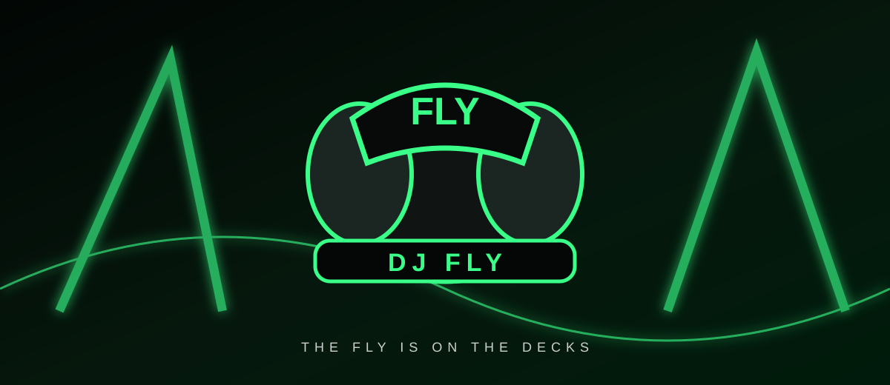
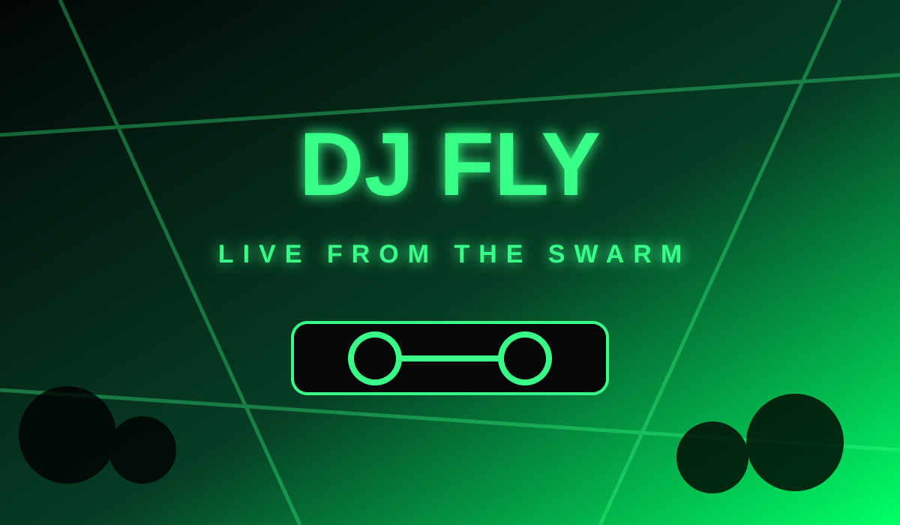
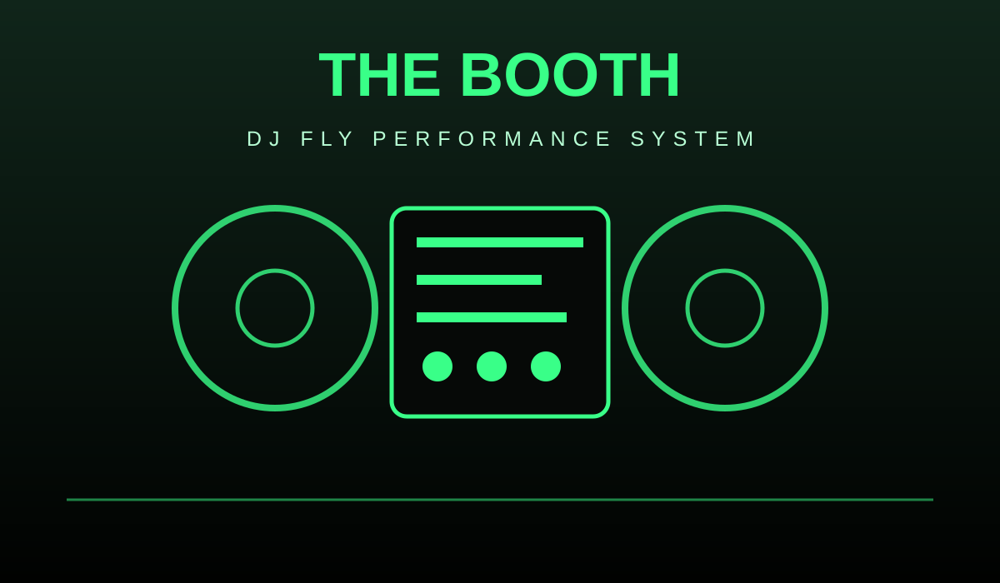
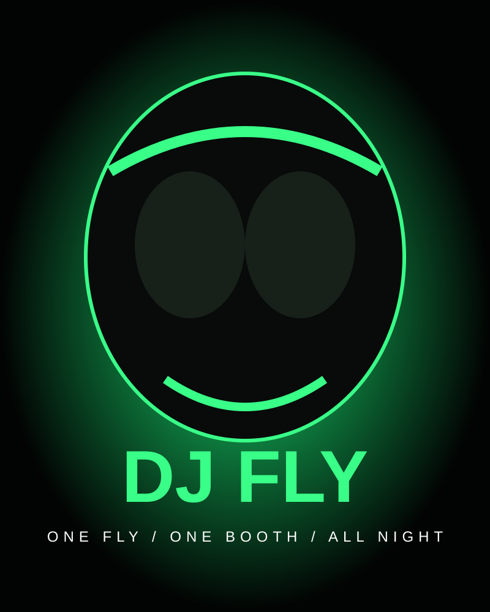
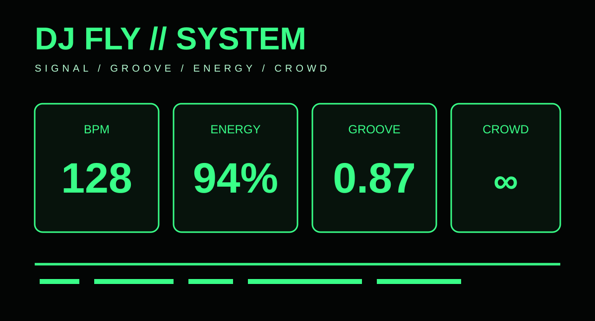

# DJ Fly

<p align="center">
  
</p>

<p align="center">
  
  
  
</p>

<p align="center">
  <b>A tiny fly. A huge sound system. One very questionable DJ.</b>
</p>

<p align="center">
  Experimental character project for DJ Fly — visuals, stage concepts, sound experiments, performance states, and strange prototypes.
</p>

---

## ⚡ The idea

DJ Fly is a fictional DJ built around one simple question: **what happens when a fly gets behind the decks and refuses to leave?**

This repository is the growing home of that character and its little universe. It mixes visual identity, fictional show documentation, audio concepts, UI experiments, and deliberately weird ideas.

### The loop

```text
        VISUAL
           ↓
      ┌─────────┐
      │ DJ FLY  │
      └─────────┘
           ↓
    SOUND → GROOVE
           ↓
        CROWD
           ↓
      MORE ENERGY
           ↺
```

## 🟢 Visual previews

<table>
<tr>
<td width="50%"></td>
<td width="50%"></td>
</tr>
<tr>
<td width="50%"></td>
<td width="50%"></td>
</tr>
</table>

More artwork, photographs, posters, alternate scenes, and performance frames can live in `assets/` as the project grows.

## 🎧 DJ Fly in one screen

| signal | current concept |
|---|---:|
| BPM | **128** |
| energy | **94%** |
| groove | **0.87** |
| stage | **NEON** |
| crowd | **FULL SWARM** |
| attitude | **UNREASONABLE** |

These values are creative demo state, not measurements from a real performance.

## 🪰 The character

**FLY** on the cap.

**FLY** on the decks.

**FLY** in the booth.

**FLY** on the poster.

Somehow the whole room starts moving.

## 🔊 What lives here

```text
assets/      artwork, posters, banners, visual previews
concepts/    stage ideas, show concepts, weird experiments
audio/       sound experiments and DJ Fly references
docs/        project notes and world-building
web/         interactive DJ Fly experiments
src/djfly/   tiny performance-state engine
tests/       lightweight checks
```

## 🕺 The booth

The DJ booth is treated as part of the character: black hardware, green light, oversized controls, FLY marks, haze, lasers, and a crowd that looks increasingly unsure about what is happening.

The visual language intentionally stays consistent across posters, interfaces, stage renders, and future video material.

## 🧪 Experiments

This repository intentionally mixes polished material with weird prototypes.

Some things are production experiments.

Some are visual jokes.

Some probably should not work at all.

That is part of the point.

## 🎛️ Run the tiny engine

```bash
pip install -e .
dj-fly
```

The command emits a deterministic performance frame containing BPM, energy, groove, and pulse values that can be used by future audio or visual prototypes.

## 📁 Visual identity

- neon green club lighting
- black DJ hardware
- oversized headphones
- sunglasses
- gold chain and FLY pendant
- dense crowd silhouettes
- haze and laser beams
- the FLY mark everywhere it can possibly fit

See [`docs/VISUALS.md`](docs/VISUALS.md) for the visual system.

## 🚧 Status

Experimental and evolving. New scenes, sounds, stage concepts, interfaces, and visual assets are expected to appear here.

## License

MIT
